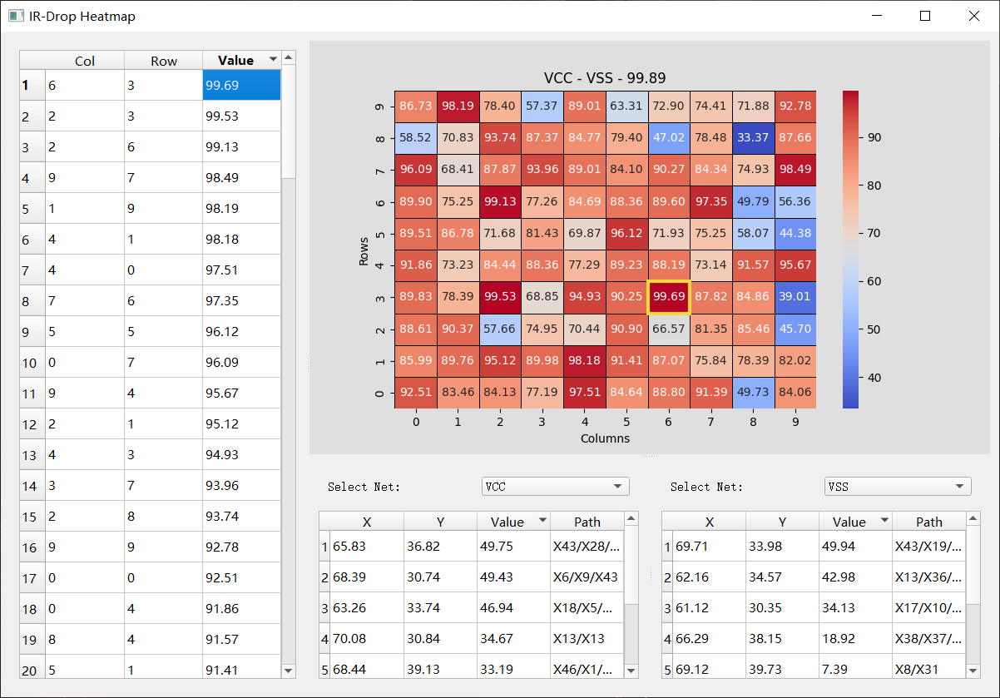
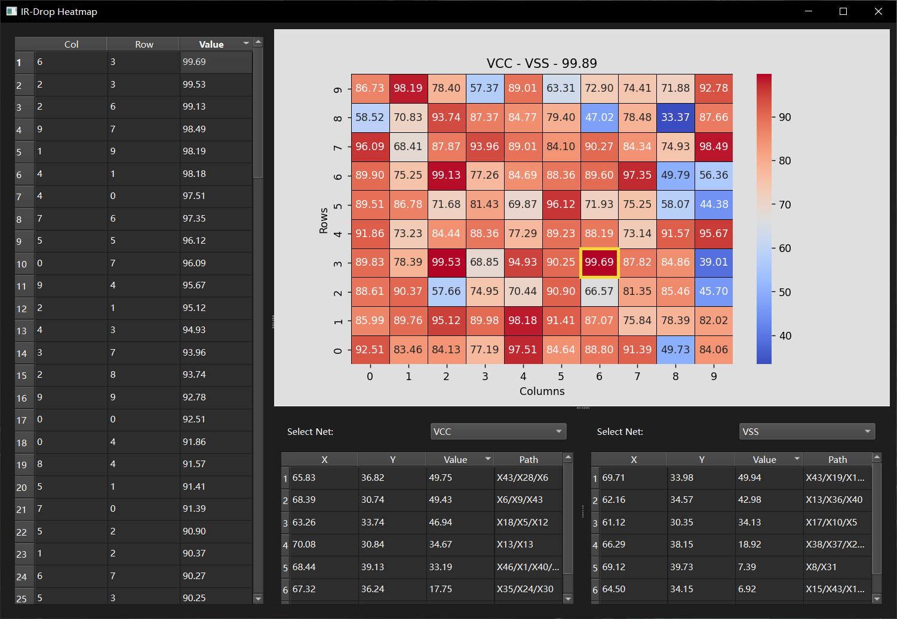

# IR Heatmap

本工具通过读取一个 `ir.list` 文件，生成一个热力图，以便于直观的查看模块的电源到地 **IR-Drop** 分布。

## 安装

```shell
pip install irhm -U
```

## 演示

+ ir.list

```text
#net  value  x      y      path
VCC   6.22   6.59   58.04  X47/X39
VSS   20.76  16.52  70.81  X33/X6/X18
VCCA  43.61  71.41  38.70  X14/X45
VSSA  30.76  58.36  64.62  X17/X26/X25/X26
VCCD  9.71   73.97  96.41  X46/X23/X38
VSSD  8.70   57.84  55.81  X24/X34/X30/X38
...
```

```shell
python3 -m irhm ir.list
```

+ PyQt5

+ PySide6


## 注意

> 项目会自动根据已安装的模块判断应该使用 `PySide6` 还是 `PyQt5`， 但为了更好的兼容性，旧版本系统（例如 CentOS 7）中建议优先使用 `PyQt5`。
